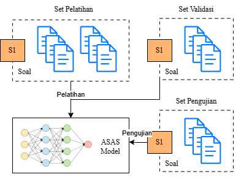

# Experiment Model

This repository contains the code, data, and experimental results for training and evaluating a model for Automatic Short Answer Scoring (ASAS) using two approaches: similarity-based scoring and direct scoring. The project leverages the BERT-based model from the Transformers library, with experiments focusing on data augmentation, model configurations (e.g., pooling, dropout), and dataset splitting scenarios (specific-prompt and cross-prompt). The repository also includes preprocessing scripts, training pipelines, and result visualizations.

**Available at:** [https://huggingface.co/bwbayu/experiment](https://huggingface.co/bwbayu/experiment)

## Project Overview

The goal of this project is to experiment with different configurations for Automatic Short Answer Scoring (ASAS) tasks, comparing similarity-based and direct regression approaches. The dataset is split into two scenarios: **specific-prompt** and **cross-prompt**, and various experiments are conducted to evaluate the impact of data augmentation, pooling strategies, and dropout rates. The repository includes all necessary scripts for preprocessing, data augmentation, model training, and result analysis, along with the best-performing model.

## Approaches and Scenarios

This section outlines the two scoring approaches and two data-splitting scenarios used in the project.

### Approaches
1. **Direct Scoring** (`main_regression.py`):

   - **Overview**: Predicts a continuous score [0, 1] for a given text using a regression-based approach. Input text is tokenized, encoded, and processed by a Transformer model (IndoBERT or mBERT), followed by a pooling layer and a dense regressor layer for end-to-end score prediction.
   - **Models Used**:
     - **IndoBERT** (indobert-lite-base-p2): A lightweight BERT model pre-trained on Indonesian corpora (11.7M parameters, 12 layers, 128 embedding size).
     - **mBERT** (google-bert/bert-base-multilingual-cased): A multilingual BERT model supporting Indonesian (177.8M parameters, 12 layers, 768 embedding size).
   - **Purpose**: Suitable for tasks requiring direct numerical scoring, such as evaluating text quality or relevance.

2. **Similarity-Based Scoring** (`main_similarity.py`):

   - **Overview**: Measures semantic similarity between a student’s answer and a reference answer using Sentence-BERT (distiluse-base-multilingual-cased-v2, 135M parameters, 6 layers). Both texts are processed by a shared-weight encoder, and their embeddings are compared using cosine similarity. A linear regression model maps the similarity score to a final predicted score.
   - **Purpose**: Ideal for tasks involving text comparison, such as assessing answer similarity to a reference.

### Scenarios
1. **Specific-Prompt** (`data/clean/specific/`):

   - **Overview**: The dataset is split by student answers for each prompt, with training, validation, and testing sets (80:10:10 ratio) drawn from the same prompts. For example, if a prompt has 10 answers, 8 are used for training, 1 for validation, and 1 for testing.
   - **Purpose**: Evaluates model performance on answers within the same prompt context, testing intra-prompt generalization.

2. **Cross-Prompt** (`data/clean/cross/`):

   - **Overview**: The dataset is split by prompts, with training, validation, and testing sets (80:10:10 ratio) containing different prompts. For example, if there are 10 prompts, 8 are used for training, 1 for validation, and 1 for testing, each with all their answers.
   - **Purpose**: Tests model robustness on unseen prompts, assessing cross-prompt generalization.

## Repository Structure

Below is an overview of the repository's directory structure and the purpose of each file and folder.

### Files in Root Directory

- **`data_aug.py`**: A Python script for data augmentation using synonym replacement, powered by the open-source LLM **Gemma3**. This script enhances the dataset by generating augmented samples to improve model robustness.
- **`main_similarity.py`**: Contains the complete pipeline for training a model using a **similarity-based scoring** approach. It includes:
  - A custom dataset class for handling the dataset.
  - A custom model class using Sentence BERT model.
  - A custom training pipeline for model training and evaluation.
- **`main_regression.py`**: Contains the complete pipeline for training a model using a **direct scoring** approach. Similar to `main_similarity.py`, it includes:
  - A custom dataset class.
  - A custom model class based using IndoBERT and mBERT.
  - A custom training pipeline.
- **`modeling_albert_default.py`**: A copy of the ALBERT model implementation from the Transformers library.
- **`preprocessing.ipynb`**: A Jupyter Notebook for data preprocessing tasks, including:
  - Checking for duplicate entries.
  - Identifying and handling missing data.
  - Cleaning the dataset to prepare it for model training.

### Directories

#### `data/`
Contains scripts and datasets used for preprocessing and splitting.

- **`split_indo.ipynb`**: A Jupyter Notebook for splitting the dataset into two scenarios:
  - **Specific-prompt**: Data split based on specific prompts.
  - **Cross-prompt**: Data split across different prompts to evaluate generalization.
- **`clean/`**: A subdirectory containing cleaned dataset files in CSV format for both scenarios:
  - **`cross/`**: CSV files for the cross-prompt scenario.
  - **`specific/`**: CSV files for the specific-prompt scenario.

#### `experiments/`
Contains the results of various experiments conducted to optimize the model.

- **`results/`**: A subdirectory with results from different experiments, organized into four folders (Includes CSV files for both specific-prompt and cross-prompt scenarios, along with visualization files):
  - **`balancing/`**: Contains results from experiments on data balancing and augmentation, comparing performance before and after augmentation.
  - **`pooling/`**: Contains results from experiments with different pooling strategies for the ALBERT model:
    - CLS pooling
    - Mean pooling
    - Max pooling
    - Attention pooling
  - **`dropout/`**: Contains results from experiments with different dropout rates (0.1, 0.3, 0.5) to evaluate their impact on model performance.
  - **`best_model/`**: Contains the best-performing model from internal experiments.

## Usage

1. **Setup**:
   - Ensure all dependencies are installed (e.g., Transformers, PyTorch, Pandas, NumPy, Jupyter).
   - Install ollama and download **Gemma3** for data augmentation (refer to `data_aug.py` for details).

2. **Preprocessing**:
   - Run `preprocessing.ipynb` to clean the dataset (remove duplicates, handle missing data).
   - Use `data/split_indo.ipynb` to split the dataset into specific-prompt and cross-prompt scenarios.

3. **Data Augmentation**:
   - Execute `data_aug.py` to augment the dataset using synonym replacement with Gemma3.

4. **Training**:
   - For similarity-based scoring, run `main_similarity.py` to train and evaluate the model.
   - For direct regression scoring, run `main_regression.py` to train and evaluate the model.

5. **Experiments**:
   - Explore the `experiments/results/` directory to analyze the outcomes of balancing, pooling, dropout, and best model experiments.
   - Visualizations in each folder provide insights into model performance for both scenarios.

## Results

The `experiments/results/` directory contains detailed results for each experiment:
- **Balancing**: Impact of data augmentation on model performance.
- **Pooling**: Comparison of CLS, mean, max, and attention pooling strategies.
- **Dropout**: Effects of different dropout rates (0.1, 0.3, 0.5) on model generalization.
- **Best Model**: The best-performing model, with results for both specific-prompt and cross-prompt scenarios.

Each folder includes CSV files with metrics and visualizations (e.g., plots) for easy analysis.